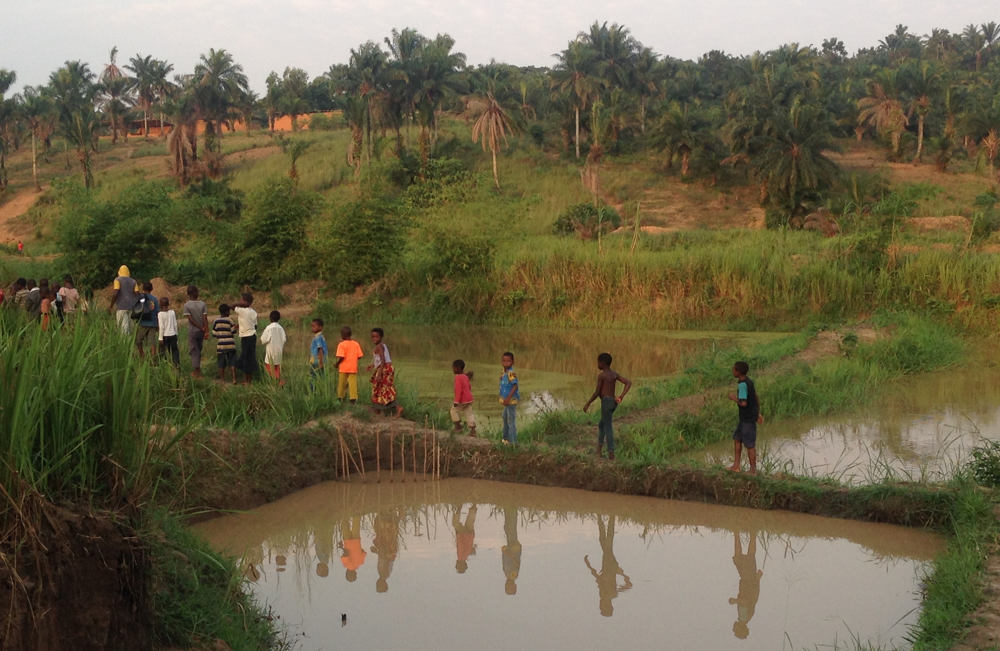

  

  

Who we are

ODEKA (Organisation d'Études Économiques au Kasaï) is an independent nonprofit research organization based in Kananga, Democratic Republic of Congo. Our mission is to generate rigorous evidence on economic development, governance, and culture to inform public policy and improve lives.

How we work

We work closely with government institutions, researchers, and local organizations to design and implement high-quality field research. Much of our work uses randomized controlled trials (RCTs) and other rigorous empirical methods to understand what policies are most effective. In particular, we collaborate closely with the Provincial Government of Kasaï Central to embed randomized evaluations within tax administration reforms, allowing us to study the causal effects of different policy interventions on public finance, state capacity, and citizen engagement.

◆

<blockquote>Because they require time in the field, experiments provide economists a richer sense of context than many would otherwise obtain.</blockquote>
<cite>Michael Kremer</cite>

  

Our history

ODEKA grew out of a research partnership established in 2013 by Elie Kabue Ngindu, Jean Muana Kasongo, Jonathan Weigel, Sara Lowes, Nathan Nunn, and James Robinson. In 2015, Elie and Jonathan founded ODEKA to mark the start of year-round operations and collaborations with the provincial government. Today, the organization is managed by Elie, Jonathan, Augustin Bergeron, and the support of a growing team of researchers, project managers, and field staff. ODEKA also collaborates with many academics based overseas including Marina Ngoma, Gabriel Tourek, Dina Pomeranz and other academic partners.

To learn more about our ongoing research, visit our Projects page.

<a class="about-button" href="/03_projects/index.html">Explore our projects →</a>

◆

With thanks to our donors and partners

National Science Foundation ◆ The Fund for Innovation in Development (FID) ◆ USAID ◆ Philomathia Foundation ◆ The International Growth Centre ◆ The Berkeley Research Opportunity Program ◆ The Weiss Family Fund ◆ SIDA ◆ J-PAL Governance Initiative ◆ J-PAL Peace and Recovery Initiative ◆ J-PAL Conflict and Violence Initiative ◆ J-PAL IGI ◆ The Kenneth C. Griffin Economics Research Fund ◆ Motsepe Fund ◆ CEPR RECIPE

**Copyright © 2026 ODEKA A.S.B.L All rights reserved.**

 

