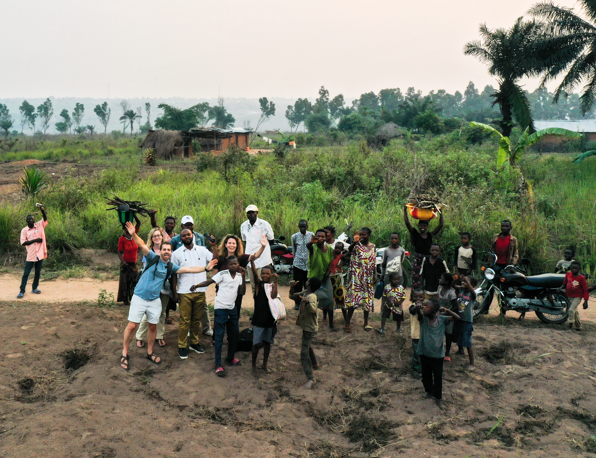
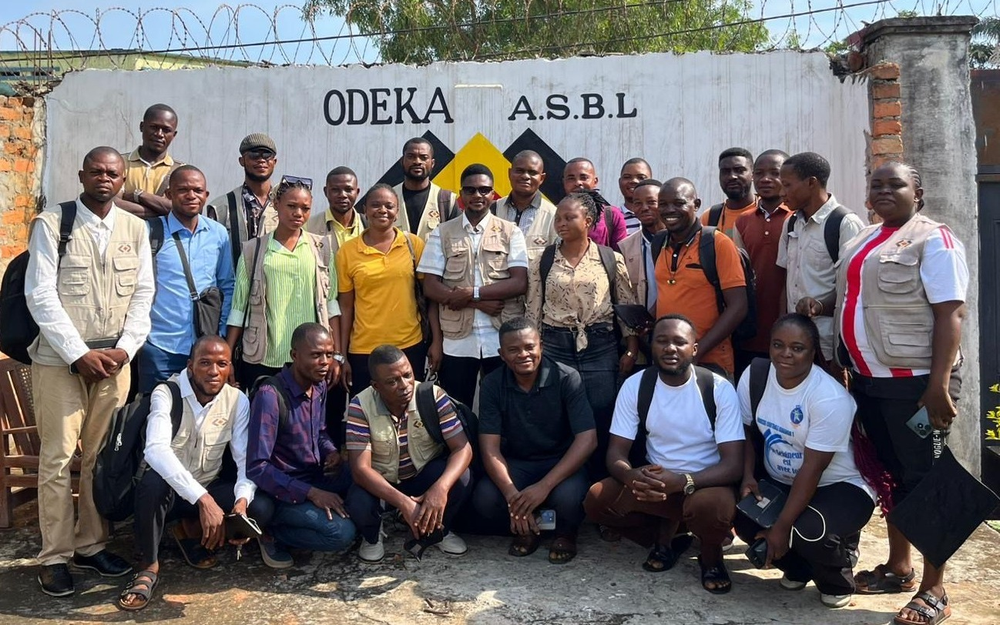
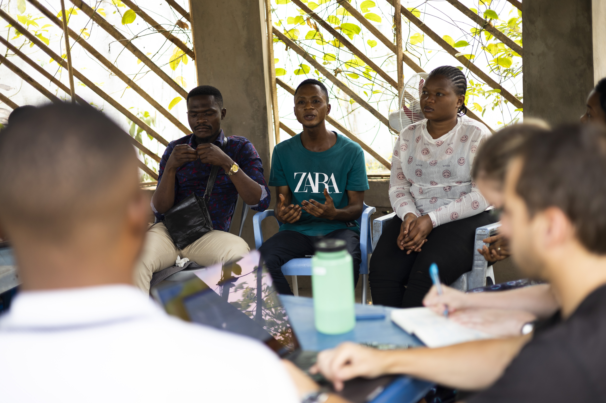
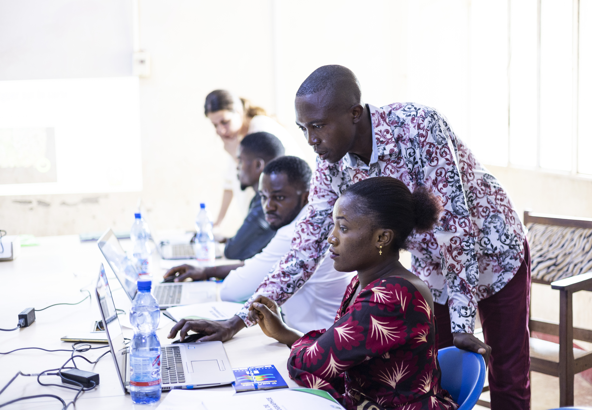
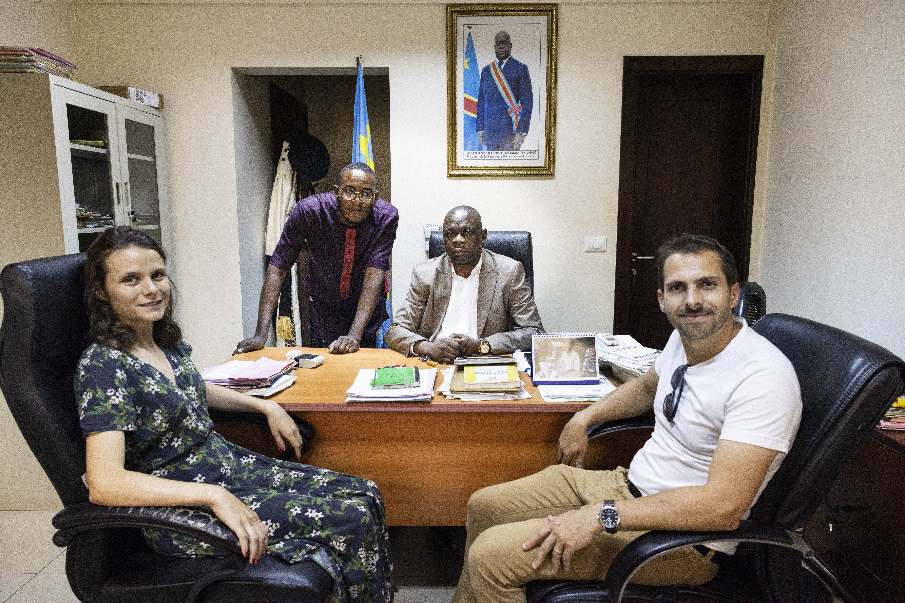
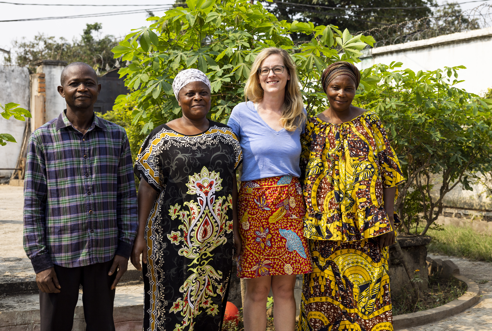
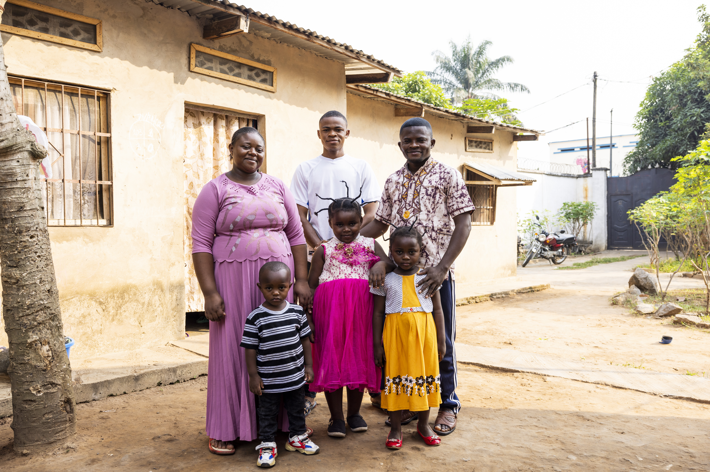

Who we are

ODEKA (Organisation d'Études Économiques au Kasaï) is an independent nonprofit research organization based in Kananga, Democratic Republic of Congo. Our mission is to generate rigorous evidence on economic development, governance, and culture to inform public policy and improve lives.

  

How we work

We work closely with government institutions, researchers, and local organizations to design and implement high-quality field research. Much of our work uses randomized controlled trials (RCTs) and other rigorous empirical methods to understand what policies are most effective. In particular, we collaborate closely with the Provincial Government of Kasaï Central to embed randomized evaluations within tax administration reforms, allowing us to study the causal effects of different policy interventions on public finance, state capacity, and citizen engagement.

  

Our history

Founded in 2015, ODEKA builds on a research partnership established in 2013 by Jonathan Weigel, Elie Kabue Ngindu, Jean Muana Kasongo, Sara Lowes, Nathan Nunn, and James Robinson. Today, the organization is jointly managed by Jonathan Weigel, Elie Kabue Ngindu, and Augustin Bergeron, with the support of a growing team of researchers, project managers, and field staff. ODEKA also collaborates with researchers including Marina Ngoma, Gabriel Tourek, and many other academic partners.

  

To learn more about our ongoing research, visit our Projects page.

<a class="about-button" href="/03_projects/index.html">Explore our projects →</a>

  

