

  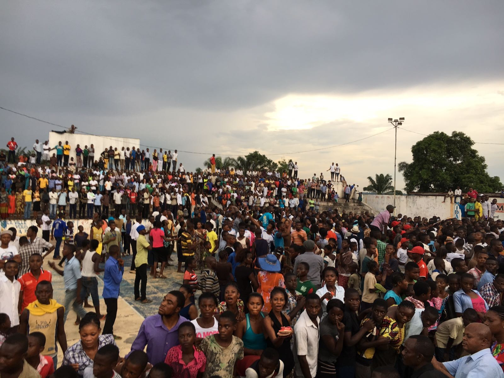

<!-- ============================ -->
<!-- ============================ -->
<!-- ============================ -->
# Senior Management {#executive-board .people-eyebrow-heading}
<!-- ============================ -->

 

  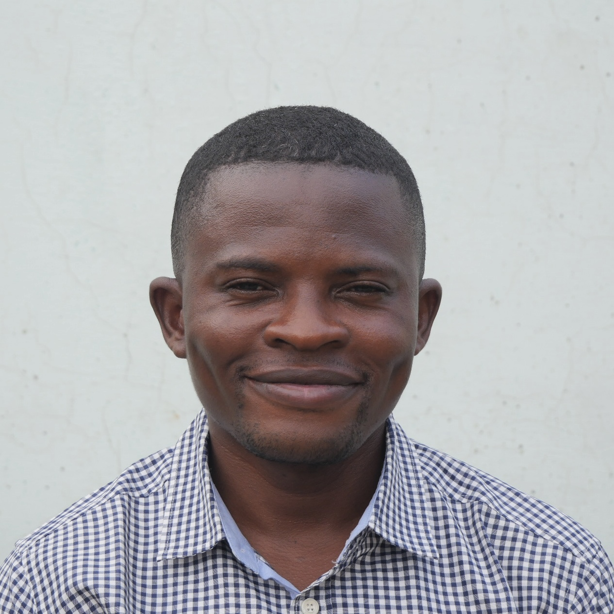

  Elie Kabue Ngindu

  Co-Founder, General Manager, and Director of Human Resources

<!-- ============================ -->

 

  

  Jon Weigel

  Co-Founder and Scientific Director

Jonathan Weigel is an assistant professor at UC Berkeley’s Haas School of Business. His research focuses on state capacity, taxation, and the relationship between culture and institutions.

<a href="https://haas.berkeley.edu/faculty/jonathan-weigel/" target="_blank">
  UC Berkeley Profile
</a>

<!-- ============================ -->

 

  

  Augustin Bergeron

  Deputy Scientific Director

Augustin Bergeron is an assistant professor of economics at Harvard University. His research focuses on state capacity and taxation, the historical roots of social structures and beliefs, and their impact on economic development.

<a href="https://www.economics.harvard.edu/people/augustin-bergeron" target="_blank">
  Harvard Profile
</a>

<!-- ============================ -->

 

  

  Espoir Malu Malu Ntumba

  Legal Advisor

<!-- ============================ -->

 

  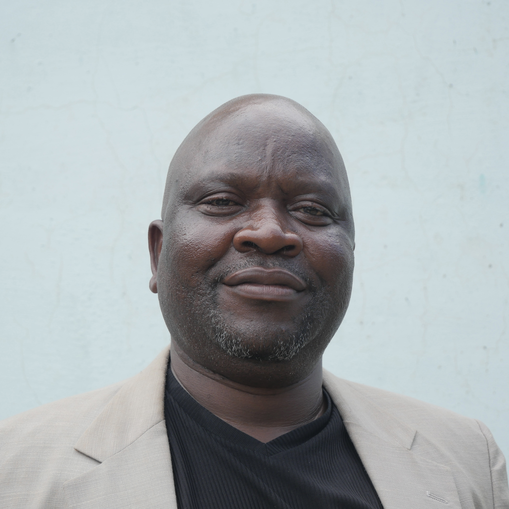

  Jean-Freddy Kabasubabo Tshimanga

  Senior Advisor and Quality Control Lead

<!-- ============================ -->

 

  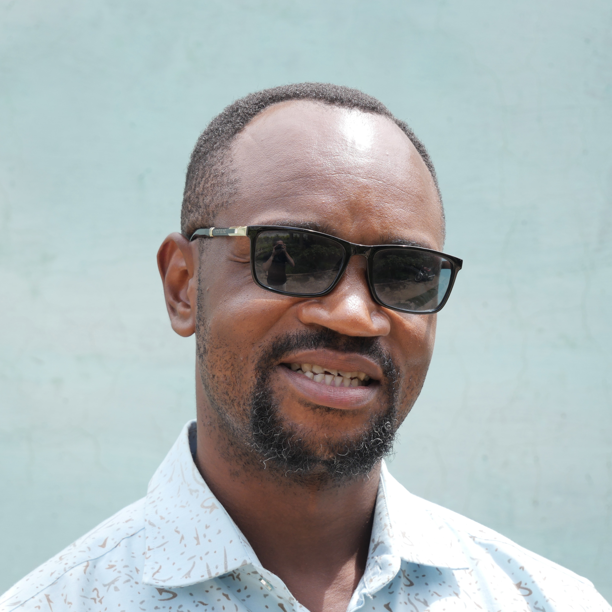

  Raphaël Fiston Mukendi Tshisanga

  Logistics and Finance Manager

<!-- ============================ -->

 

  

  Junior

  Quality Control Officer

<!-- ============================ -->

 

  

  Gilbert

  Coordinator

<!-- ============================ -->

 

  

  Jacques

  Coordinator

<!-- ============================ -->

<!-- ============================ -->
<!-- ============================ -->
<!-- ============================ -->

# Senior Enumerators {.people-eyebrow-heading}

ODEKA's senior enumerators play a central role in supervising data collection, training field teams, and ensuring high-quality implementation of research projects.
<!-- ============================ -->

 

  

  Max

  Enumerator

<!-- ============================ -->

 

  

  Grégoire

  Enumerator

<!-- ============================ -->

 

  

  Bernard

  Enumerator

<!-- ============================ -->

 

  

  Serge

  Enumerator

<!-- ============================ -->

 

  

  André

  Enumerator

<!-- ============================ -->

 

  

  Benjamin

  Enumerator

<!-- ============================ -->

 

  

  Théo

  Enumerator

<!-- ============================ -->

 

  

  Jean

  Enumerator

<!-- ============================ -->

<!-- ============================ -->
<!-- ============================ -->
<!-- ============================ -->

# Scientific Advisory Committee {.people-eyebrow-heading}

ODEKA's Scientific Advisory Committee provides guidance on the organization's scientific strategy, research design, and long-term development.
<!-- ============================ -->

 

  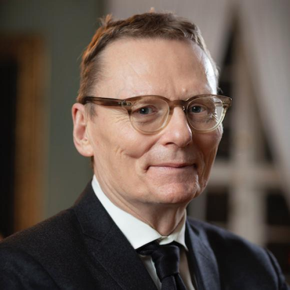

  James Robinson

  Member

A Nobel Prize laureate, James Robinson is a professor at the University of Chicago’s Harris School of Public Policy and Department of Political Science. His research examines the political and institutional foundations of development and the historical roots of prosperity and poverty.

<a href="https://harris.uchicago.edu/directory/james-robinson" target="_blank">
  UChicago Profile
</a>

<!-- ============================ -->

 

  

  Nathan Nunn

  Member

Nathan Nunn is a professor at the Vancouver School of Economics. His research explores the historical and cultural foundations of economic development and how local contexts shape the effectiveness of policies and institutions.

<a href="https://nathannunn.arts.ubc.ca" target="_blank">
  UBC Profile
</a>

<!-- ============================ -->

 

  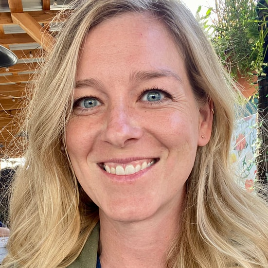

  Sara Lowes

  Member

Sara Lowes is an associate professor of economics at the University of California, San Diego. Her research sits at the intersection of development economics, economic history, and political economy, examining how culture and institutions shape development outcomes.

<a href="https://economics.ucsd.edu/faculty-and-research/faculty-profiles/lowes.html" target="_blank">
  UCSD Profile
</a>

<!-- ============================ -->

 

  

  Gabriel Tourek

  Member

Gabriel Tourek is an assistant professor of economics at the University of California, Davis. His research focuses on public finance and development economics, with an emphasis on state capacity and governance in low-income countries.

<a href="https://economics.ucdavis.edu/people/gabriel-tourek" target="_blank">
  UC Davis Profile
</a>

<!-- ============================ -->

 

  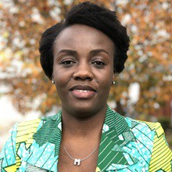

  Marina Ngoma Mavungu

  Member

Marina Ngoma Mavungu is an economist at the World Bank, specializing in economic development with a focus on private sector policies, industrialization, regional integration, public finance, and institutions.

<a href="https://www.worldbank.org/en/about/people/m/marina-ngoma-mavungu" target="_blank">
  World Bank Profile
</a>

<!-- ============================ -->

<!-- ============================ -->
<!-- ============================ -->
<!-- ============================ -->

# PhD Students {.people-eyebrow-heading}

ODEKA works closely with doctoral students who contribute to our research projects and field activities.
<!-- ============================ -->

 

  

  Clotaire Boyer

  PhD Student

<!-- ============================ -->

 

  

  Sarah Danner

  PhD Student

<!-- ============================ -->

 

  

  Eva Davoine

  PhD Student

<!-- ============================ -->

 

  

  Gabriel Granato

  PhD Student

<!-- ============================ -->

 

  

  Arthur Laroche

  PhD Student

<!-- ============================ -->

 

  

  Nic Wicaksono

  PhD Student

<!-- ============================ -->

<!-- ============================ -->
<!-- ============================ -->
<!-- ============================ -->

# Research Associates {.people-eyebrow-heading}

ODEKA works closely with research associates who contribute to our research projects and field activities.
<!-- ============================ -->

<!-- ============================ -->
<!-- ============================ -->
<!-- ============================ -->

# Research Interns {.people-eyebrow-heading}

ODEKA works closely with research interns who contribute to our research projects and field activities.
<!-- ============================ -->

<!-- ============================ -->

<!-- ============================ -->
<!-- ============================ -->
<!-- ============================ -->

# Past PhD Students {.people-eyebrow-heading}

We are grateful to the PhD students who contributed to ODEKA's work over the years.
<!-- ============================ -->

 

  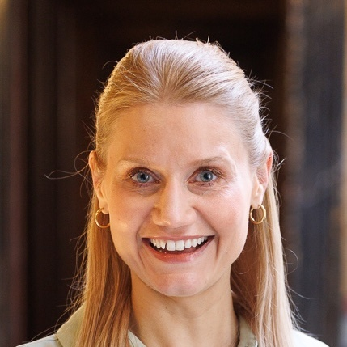

  Clara Sievert

  PhD student, 2021-2024

**Placement:** CERGE-EI 
**PhD:** Harvard University

<a href="https://www.linkedin.com/in/clara-sievert-harvard/" target="_blank">
  LinkedIn Profile
</a>

<!-- ============================ -->

 

  

  Marina Ngoma Mavungu

  PhD student, 2020-2022

**Placement:** World Bank 
**PhD:** Tufts University

<a href="https://www.linkedin.com/in/marina-mavungu-ngoma-b5b16411b/" target="_blank">
  LinkedIn Profile
</a>

<!-- ============================ -->

<!-- ============================ -->
<!-- ============================ -->
<!-- ============================ -->

# Past Research Associates {#past-directors .people-eyebrow-heading}

We are grateful to the many research associates who contributed to ODEKA's work over the years.
<!-- ============================ -->

 

  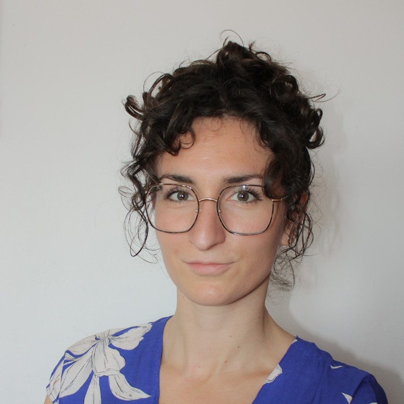

  Manon Bellot

  Predoctoral Research Associate, 2023-2025

**Next position:** Consultant, World Bank 
**Previous position:** MSc Development Economics, Université Paris 1 Panthéon Sorbonne

<a href="https://www.linkedin.com/in/manon-bellot-409b08204/?locale=en_US" target="_blank">
  LinkedIn Profile
</a>

<!-- ============================ -->

 

  

  Adèle Somat

  Research Associate, 2023-2025

**Next position:** Project Officer, LoGRI 
**Previous position:** MPhil Inernational Political Economy, King's College London

<a href="https://www.linkedin.com/in/adelesomat/?originalSubdomain=fr" target="_blank">
  LinkedIn Profile
</a>

<!-- ============================ -->

 

  

  Zacharie Quiviger

  Research Associate, 2023-2024

**Next position:** Researcher, SOAS University of London, then PhD in International Relations, Columbia University 
**Previous position:** MPhil Politics and International Studies, Cambridge University

<a href="https://www.linkedin.com/in/zachariequiviger/" target="_blank">
  LinkedIn Profile
</a>

<!-- ============================ -->

 

  

  Robin Benabid Jegaden

  Predoctoral Research Associate, 2022-2024

**Next position:** Research Engineer in Economics, CNRS 
**Previous posititon:** MSc Development Economics, Université Paris 1 Panthéon Sorbonne

<a href="https://www.linkedin.com/in/robin-benabid-jegaden-630446157/?originalSubdomain=fr" target="_blank">
  LinkedIn Profile
</a>

<!-- ============================ -->

 

  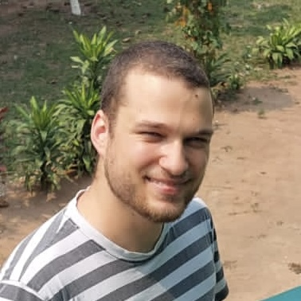

  Dylan Reich

  Research Associate, 2022-2023

**Next position:** Research Assistant, Oxford University 
**Previous position:** MSc Development Management, Applied Development Economics, LSE

<a href="https://www.linkedin.com/in/dylan-reich-9709231a0/" target="_blank">
  LinkedIn Profile
</a>

<!-- ============================ -->

 

  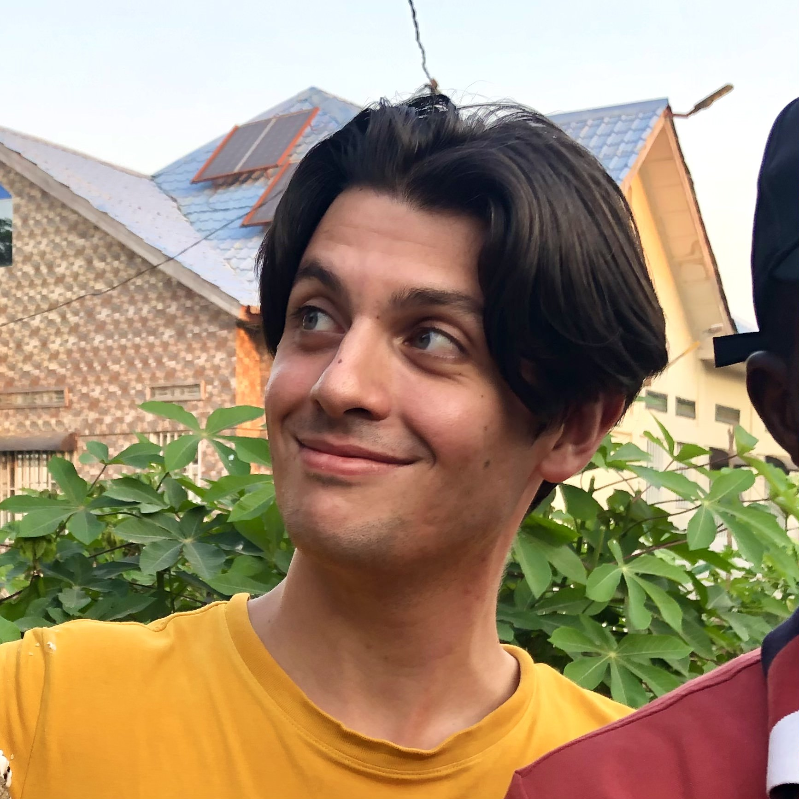

  Adrien Foutelet

  Predoctoral Research Associate, 2021-2023

**Next position:** PhD in Economics, Brown University 
**Previous position:** MSc Analysis and Policy in Economics, ENS Lyon

<a href="https://www.linkedin.com/in/adrien-foutelet-110b37168/" target="_blank">
  LinkedIn Profile
</a>

<!-- ============================ -->

 

  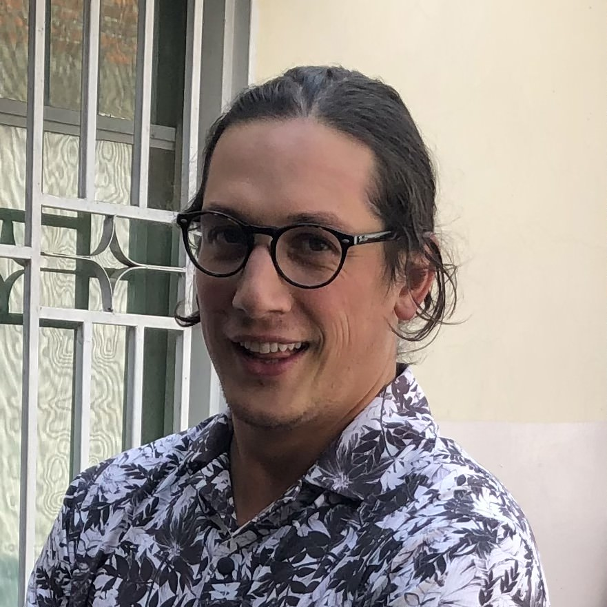

  Jean-François Coté

  Predoctoral Research Associate, 2020-2022

**Next position:** Consultant, CPCS 
**Previous position:** Economist, Treasury Board of Canada

<a href="https://www.linkedin.com/in/jf-côté/" target="_blank">
  LinkedIn Profile
</a>

<!-- ============================ -->

 

  

  Arthur Laroche

  Predoctoral Research Associate, 2019-2021

**Next position:** PhD in Economics, UCL 
**Previous position:** MSc Mathematics, Statistics, Economics, Ecole nationale des ponts et chaussées

<a href="https://www.linkedin.com/in/arthur-laroche-294774133/" target="_blank">
  LinkedIn Profile
</a>

<!-- ============================ -->

<!-- ============================ -->
<!-- ============================ -->
<!-- ============================ -->

# Past Research Interns {.people-eyebrow-heading}
We are grateful to the many research interns who contributed to ODEKA's work over the years.
<!-- ============================ -->

  Zoé Baudoin

  Research Intern, 2023-2024

<a href="https://www.linkedin.com/in/zoé-baudoin/?locale=en_US" target="_blank">
  LinkedIn Profile
</a>

<!-- ============================ -->

  Kip Peeling

  Research Intern, 2023

<a href="https://www.linkedin.com/in/kip-peeling-b397541a7/?originalSubdomain=uk" target="_blank">
  LinkedIn Profile
</a>

<!-- ============================ -->

  Fadela Zouleya

  Research Intern, 2023

<a href="https://www.linkedin.com/in/fadela-sadou-zouleya-b41197141/" target="_blank">
  LinkedIn Profile
</a>

<!-- ============================ -->

  Laure Lepine

  Research Intern, 2022

<a href="https://www.linkedin.com/in/laure-lépine/?originalSubdomain=ma" target="_blank">
  LinkedIn Profile
</a>

<!-- ============================ -->

  Morgane Garcia

  Research Intern, 2022

<a href="https://www.linkedin.com/in/morgane-garcia-a6247b1a0/?locale=fr_FR" target="_blank">
  LinkedIn Profile
</a>

<!-- ============================ -->

  Romaine Loubes

  Research Intern, 2022

<a href="https://www.linkedin.com/in/romaine-loubes-56038217b/?originalSubdomain=fr" target="_blank">
  LinkedIn Profile
</a>

<!-- ============================ -->

  Charlotte Humes

  Research Intern, 2021

<a href="https://www.linkedin.com/in/charlotte-humes-11330764/" target="_blank">
  LinkedIn Profile
</a>

<!-- ============================ -->

  Sara Merner

  Research Intern, 2020-2021

<a href="https://www.linkedin.com/in/saramerner/?originalSubdomain=fr" target="_blank">
  LinkedIn Profile
</a>

<!-- ============================ -->

 

  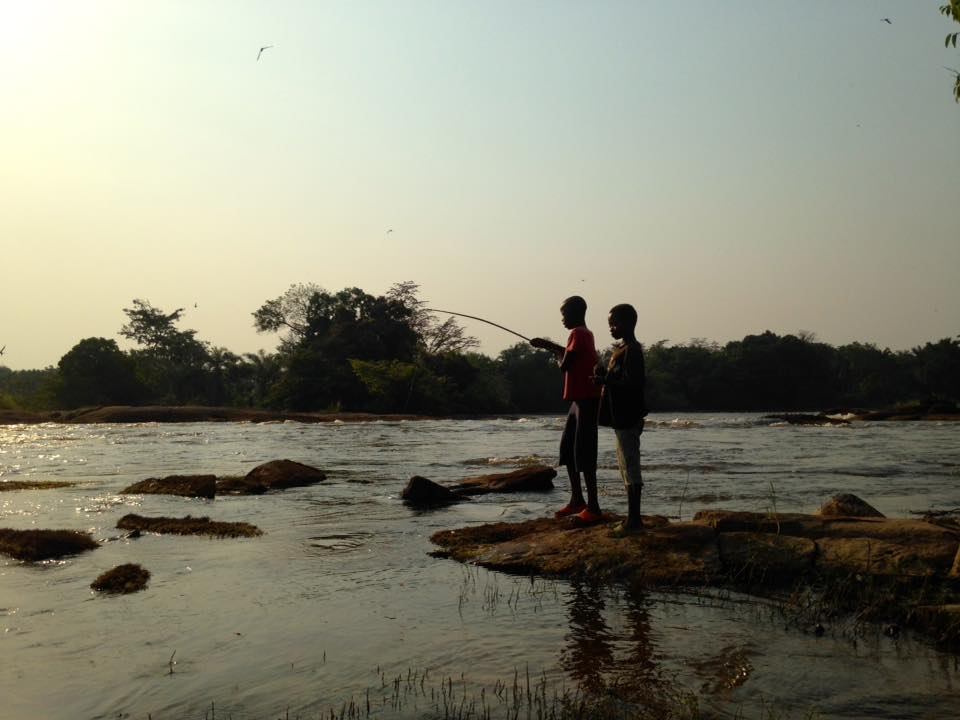

**Copyright © 2026 ODEKA A.S.B.L All rights reserved.**

 

  <a href="https://twitter.com" class="about-link" rel="" target="">
    <i class="bi bi-twitter"></i>
     twitter
  </a>
  <a href="https://www.instagram.com/gateau_thecongolesecat/" class="about-link" rel="" target="">
    <i class="bi bi-instagram"></i>
     Instagram
  </a>
  <a href="https://linkedin.com" class="about-link" rel="" target="">
    <i class="bi bi-linkedin"></i>
     LinkedIn
  </a>

