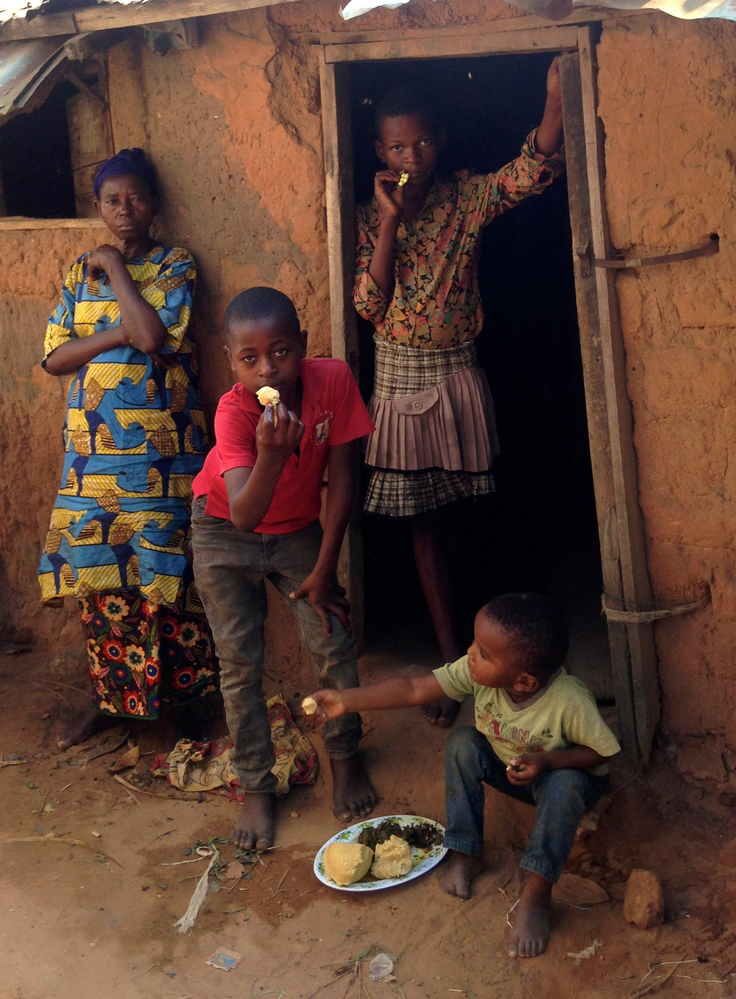

  

ODEKA conducts field research in the Democratic Republic of Congo focused on several themes in development economics, public finance, and political economy. Our work falls into two research agendas: (1) building fiscal capacity and state accountability in fragile settings, and (2) the interaction between culture and institutions. The first asks how governments with limited administrative capacity can raise revenue — and whether taxation, in turn, leads citizens to demand more from the state. For this work, we work closely with the Provincial Government of Kasaï Central and especially with the provincial tax authority, the Direction Générale des Recettes du Kasaï Central. The second research agenda asks how political and economic institutions shape the values, beliefs, and norms that people hold, and how those in turn shape economic development. Below you can find some of the projects we have worked on to date, including the resulting papers (if available).

I. Building Fiscal Capacity and State Accountability in Fragile Settings

- Weigel JL. 2020. “The Participation Dividend of Taxation: How Citizens in Congo Engage More with the State when It Tries to Tax Them.” *Quarterly Journal of Economics* 135(4): 1849-1903. [Paper](https://jonathan-weigel.squarespace.com/s/participation_dividend_qje_final.pdf). [Appendix](https://jonathan-weigel.squarespace.com/s/weigel_participation_dividend_appendix-j54s.pdf). Related links: [Vox Dev](https://voxdev.org/topic/public-economics/can-taxation-stimulate-political-participation-evidence-democratic-republic-congo), [ICTD](https://www.ictd.ac/blog/participation-property-taxation-drc/), [Law360](https://www.law360.com/tax-authority/articles/1309089/taxation-representation-and-civic-participation-in-congo), [World Bank](http://blogs.worldbank.org/impactevaluations/no-participation-without-taxation-evidence-randomized-tax-collection-dr-congo-guest-post-jonathan). 

Abstract
This article provides evidence from a fragile state that citizens demand more of a voice in the government when it tries to tax them. I examine a field experiment randomizing property tax collection across 356 neighborhoods of a large Congolese city. The tax campaign was the first time most citizens had been registered by the state or asked to pay formal taxes. It raised property tax compliance from 0.1% in control to 11.6% in treatment. It also increased political participation by about 5 percentage points (31%): citizens in taxed neighborhoods were more likely to attend town hall meetings hosted by the government or submit evaluations of its performance. To participate in these ways, the average citizen incurred costs equal to their daily household income, and treated citizens spent 43% more than control. Treated citizens also positively updated about the provincial government, perceiving more revenue, less leakage, and a greater responsibility to provide public goods. The results suggest that broadening the tax base has a "participation dividend," a key idea in historical accounts of the emergence of inclusive governance in early modern Europe and a common justification for donor support of tax programs in weak states.

- Balan P, Bergeron A, Tourek G, Weigel JL. 2022. “Local Elites as State Capacity: How Local Information Increases Tax Compliance in the D.R. Congo.” *American Economic Review* 112(3): 1-36. [Paper](https://static1.squarespace.com/static/59832fbcf9a61eb15deffb3c/t/64c5609aef61a10b12bcc768/1690656922882/balan-et-al_chieftaxation_aer_2022.pdf). [VoxDev](https://voxdev.org/topic/public-economics/can-low-capacity-governments-work-local-leaders-increase-tax-revenues-evidence-democratic-republic-congo). 

Abstract
This paper investigates the trade-offs between local elites and state agents as tax collectors in low-capacity states. We study a randomized policy experiment assigning neighborhoods of a large Congolese city to property tax collection by city chiefs or state agents. Chief collection raised tax compliance by 3.2 percentage points, increasing revenue by 44 percent. Chiefs collected more bribes but did not undermine tax morale or trust in government. Results from a hybrid treatment arm in which state agents consulted with chiefs before collection suggest that chief collectors achieved higher compliance by using local information to more efficiently target households with high payment propensities, rather than by being more effective at persuading households to pay conditional on having visited them.

- Bergeron A, Weigel JL, Tourek G, Ngindu EK ®. 2022. “Does Collecting Taxes Erode the Responsiveness of Informal Leaders? Evidence from the DRC” R&R, *American Economic Journal - Economic Policy*. Winner of IIPF Peggy and Richard Musgrave Prize 2023. [Working Paper](https://jonathanweigel.com/s/bergeron-et-al_chieftargeting.pdf). 

Abstract
In weak states, delegating tax collection to informal leaders may raise revenue but risks undermining their responsiveness to local preferences. We investigate this tradeoff by exploiting whether city chiefs in D.R. Congo were randomly assigned to collect property taxes. To measure responsiveness, we study chiefs' distribution of resources in a government cash transfer program. In line with citizens' preferences, chiefs who collected taxes allocated more program benefits to poorer households. The results help allay concerns about the effects of chief tax collection on local governance and highlight a synergy between the information needed by low-capacity states for taxation and transfers.

- De La O AL, Green DP, John P, Goldszmidt R, Lenz AK, Valdivia M, Zucco C, Christensen D, Garfias F, Balán P, Bergeron A, Tourek G, Weigel JL, Gottlieb J, LeBas A, Magat J, Obikili N, Bowers J, Chen N, Grady C, Winters M, Gaikwad N, Nellis G, Thomas A, and Hyde S. 2022. “Barriers to Formalization: Evidence from Six Randomized Experiments on Transaction Costs, Public Services, and Taxation in the Global South.” [PDF](https://jonathanweigel.com/s/Metaketa_II_paper2026_Submission_Nature2026.pdf). 

Abstract
We present six harmonized RCTs to assess whether removing bureaucratic hurdles can encourage individuals to engage formally with the state in six countries in the Global South. Recent work has argued that the trade-offs inherent to formalization are more acceptable to individuals when formalization is tied to publicly-derived benefits, such as access to legal recourse in disputes, public services, or public utilities. Yet, even in these cases, bureaucratic barriers to formalization might be insurmountable. So far, disconnected research on different bureaucratic procedures has led to contrasting conclusions about how entry costs affect formalization. Our interventions involved in-person assistance to reduce the upfront transaction costs of dealing with the bureaucracy in three types of policy domain: titling property, registration of small businesses, and access to public utilities (i.e., municipal water) and public services (i.e., garbage collection). A meta-analysis shows that the average effect of these interventions on individuals' formalization, tax payment, and access to services is indistinguishable from zero. We also find substantial heterogeneity in individuals' intent to undertake and complete the bureaucratic process. Across policy domains, individuals are more willing to bear formalization's downstream costs when the benefits are individual. Our results also suggest that local bureaucratic incentives must be aligned for demand-side interventions to work.

- Weigel JL, Ngindu EK. 2023. “The Taxman Cometh: Pathways Out of a Low-Capacity Trap in the Democratic Republic of the Congo.” *Economica* (100th Anniversary Edition) 12489: 1-35. [Paper](https://static1.squarespace.com/static/59832fbcf9a61eb15deffb3c/t/6aa8831d4762440a18a2ae14/1789428509285/weigel-ngindu_taxman-cometh_Ecca_2023.pdf). 

Abstract
How might fragile states escape a low-capacity trap in which citizens pay little tax and the government has insufficient revenue to increase enforcement or provide public goods? We argue that governments can escape such traps by regularizing tax collection. When citizens observe taxes being collected in a systematic, non-arbitrary manner, they are likely to update positively about the procedural performance of the government, increasing their intrinsic motivation to comply. We test this idea in the first door-to-door property tax collection campaign in Kananga, Democratic Republic of the Congo, which raised compliance from near zero to 10.3%. Linking pre-campaign surveys with administrative tax data, we document a strong relationship between citizens' prior perceptions of government performance and property tax payment. Then, exploiting the campaign's random roll-out, we find that systematic tax collection caused citizens to update positively about the government's procedural performance. Together, these results are consistent with a virtuous cycle of perceived government performance and fiscal capacity.

- Ahrenshop M, Bergeron A, Paler L, Tourek G, Weigel JL. 2023. “Delegating Tax Collection to Local Elites Does Not Undermine Demand for Accountability in the D.R. Congo.” [Working Paper](https://static1.squarespace.com/static/59832fbcf9a61eb15deffb3c/t/64adcff6ae42c24a0f6735d3/1689112655169/Chief_Good_II.pdf). 

Abstract
While past scholarship finds that taxation catalyzes citizen participation, little is known about how the delegation of tax collection to local non-state actors—a common practice in developing countries—affects the fiscal contract between citizens and the state. Tax collection by local leaders rather than state agents could undermine the formation of a fiscal contract by shifting the locus of accountability. We examine a policy experiment in which 101 neighborhoods in Kananga, a large city in the D.R. Congo, were randomly assigned to property tax collection by state agents or local city chiefs. We combine this source of variation with a novel behavioral measure of collective action in which 2,631 citizens could request audit meetings related to a government-run antipoverty program in the neighborhood. We find no evidence that the type of agent in charge of tax collection differentially affected citizens' propensity to hold the state or chief accountable. Our results indicate that delegating tax collection to local leaders in low-capacity states can increase revenue without adverse consequences for accountability.

- Bergeron A, Tourek G, and Weigel JL. 2024. “The State Capacity Ceiling on Tax Rates: Evidence from Randomized Tax Abatements in the D.R. Congo.” *Econometrica* 92(4): 1163-1193. [Paper](https://jonathan-weigel.squarespace.com/s/bergeron-et-al_state-capacity-ceiling_ecma_2023.pdf). [JPAL Summary](https://www.povertyactionlab.org/evaluation/impact-reducing-tax-rates-and-strengthening-enforcement-revenue-collection-drc). 

Abstract
This paper investigates how tax rates and tax enforcement jointly impact fiscal capacity in low-income countries. We study a policy experiment in the D.R. Congo that randomly assigned 38,028 property owners to the status quo tax rate or to a rate reduction. This variation in tax liabilities reveals that the status quo rate lies above the revenue-maximizing tax rate (RMTR). Reducing rates by about one-third would maximize government revenue by increasing tax compliance. We then exploit two sources of variation in enforcement—randomized enforcement letters and random assignment of tax collectors—to show that the RMTR increases with enforcement. Including an enforcement message on tax letters or replacing tax collectors in the bottom quartile of enforcement capacity with average collectors would raise the RMTR by about 40%. Tax rates and enforcement are thus complementary levers. Jointly optimizing tax rates and enforcement would lead to 10% higher revenue gains than optimizing them independently. These findings provide experimental evidence that low government enforcement capacity sets a binding ceiling on the revenue-maximizing tax rate in some developing countries, thereby demonstrating the value of increasing tax rates in tandem with enforcement to expand fiscal capacity.

- Weigel JL, Bessone P, Bergeron A, Tourek G, Kabeya J ®. 2026. “Supermodular Bureaucrats: Evidence from Randomly Assigned Tax Collectors in the DRC.” Cond. Accepted, *American Economic Review*. [Paper](https://jonathanweigel.com/s/weigel_et-al_collectors.pdf). 

Abstract
The assignment of workers to tasks and teams is a key margin of firm productivity and a potential source of state effectiveness. This paper investigates whether a low-capacity state can increase its tax revenue by improving the assignment of its tax collectors. We study the two-stage random assignment of property tax collectors into teams and to neighborhoods in a large Congolese city. The optimal assignment involves positive assortative matching on both dimensions: high (low) ability collectors should be paired together, and high (low) ability teams should be paired with high (low) payment propensity households. Positive assortative matching stems from complementarities in collector-to-collector and collector-to-household match types. We provide evidence that these complementarities reflect high-ability collectors exerting greater effort when matched with other high-ability collectors. According to our estimates, implementing the optimal assignment would increase tax compliance by 3.75 percentage points and revenue by 38% relative to the status quo (random) assignment. Alternative policies, such as replacing low-ability collectors with new ones of average ability or increasing collectors' performance wages, are likely incapable of achieving a similar revenue increase.

- Balan P, Bergeron A, Tourek G, Weigel JL. 2026. “Property Rights and Social Institutions in Urban Africa: Experimental Evidence from a Land Formalization Program in the DRC.” Cond. Accepted, *Comparative Political Studies*. Paper.
- Tourek G, Laroche A, Bergeron A, Naritomi J, Weigel JL, Ngoma M ®. 2026. “Does Progressivity Raise Tax Capacity? Experimental Evidence from DR Congo.” [Working Paper](https://jonathanweigel.com/s/Progressivity_20260710.pdf). 

Abstract
Progressive taxation is central to high-income countries' tax systems, but developing countries typically rely on less progressive instruments. We study the introduction of progressive property taxation in a large Congolese city through a citywide field experiment conducted in partnership with the provincial government. Neighborhoods were randomly assigned to a progressive or proportional schedule. The progressive schedule increased revenue by 56% relative to the proportional one. Gains occurred throughout the property value distribution: at the top, higher statutory rates mechanically raised revenue despite modest compliance losses; at the bottom, lower rates induced compliance gains large enough to offset lower liabilities. Cross-randomized information treatments show that taxpayers responded primarily to their own rates, not to others' rates or to the perceived fairness of the overall schedule. Effective tax rates—taxes paid as a share of property value—declined with property value and were most regressive under the progressive schedule. However, after a progressive schedule was scaled up citywide in subsequent years, targeted enforcement among high-value properties reversed this pattern, aligning statutory and effective rates. Together, the results suggest that progressive property taxation can raise fiscal capacity in low-income settings and, when paired with targeted enforcement, further shift the tax burden onto wealthier property owners.

- Bergeron A, Davoine E, Granato G, Ngoma M, Robinson JA, Weigel JL. 2026. “Legal Antecedents of Fiscal Capacity: Experimental Evidence from Congo.” [fieldwork ongoing]
- Bergeron A, Boyer C, Kapon S, Weigel JL. 2026. “Does Tax Bargaining Cause State Building? Evidence from the DRC” [fieldwork ongoing]
- Danner S, Ngoma M, Pomeranz D, Tourek G, Weigel JL. 2026. “Can Mobile Money Aid Tax Administration? Evidence from the DRC” [fieldwork ongoing]
- Danner S, Ngoma M, Pomeranz D, Tourek G, Weigel JL. 2026. “Home Effects in Tax Collection: Evidence from the DRC” [fieldwork ongoing]

II. Interaction Between Culture and Institutions

- Lowes S, Nunn N, Robinson JA, and Weigel JL. 2015. “Understanding Ethnic Identity in Africa: Evidence from the Implicit Association Test (IAT).” *American Economic Review: P&P* 105(5):1-8. [PDF](https://jonathanweigel.com/s/lowes_nunn_robinson_weigel_aerpp_2015.pdf). [Appendix](https://jonathanweigel.com/s/iat_appendix.pdf). [VoxEU](http://www.voxeu.org/article/measuring-identity-tropics). 

Abstract
We use a variant of the Implicit Association Test (IAT) to examine individuals' implicit attitudes towards various ethnic groups. Using a population from the Democratic Republic of Congo, we find that the IAT measures show evidence of an implicit bias in favor of one's own ethnicity. Individuals have implicit views of their own ethnic group that are more positive than their implicit views of other ethnic groups. We find this implicit bias to be quantitatively smaller than the (explicit) bias one finds when using self-reported attitudes about different ethnic groups.

- Lowes S, Nunn N, Robinson JA, and Weigel JL. 2017. “The Evolution of Culture and Institutions: Evidence from the Kuba Kingdom.” *Econometrica* 85(4): 1065-1091. [PDF](https://jonathanweigel.com/s/Lowes-et-al_ECMA_Kuba_Final.pdf). [Appendix](https://jonathanweigel.com/s/kuba_appendix.pdf). Related links: [Cato Institute](https://www.cato.org/publications/research-briefs-economic-policy/evolution-culture-institutions-evidence-kuba-kingdom). 

Abstract
We use variation in historical state centralization to examine the long-term impact of institutions on cultural norms. The Kuba Kingdom, established in Central Africa in the early 17th century by King Shyaam, had more developed state institutions than the other independent villages and chieftaincies in the region. It had an unwritten constitution, separation of political powers, a judicial system with courts and juries, a police force, a military, taxation, and significant public goods provision. Comparing individuals from the Kuba Kingdom to those from just outside the Kingdom, we find that centralized formal institutions are associated with weaker norms of rule following and a greater propensity to cheat for material gain. This finding is consistent with recent models where endogenous investments to inculcate values in children decline when there is an increase in the effectiveness of formal institutions that enforce socially desirable behavior. Consistent with such a mechanism, we find that Kuba parents believe it is less important to teach children values related to rule-following behaviors.

- Lang M, Purzycki BG, Apicella CL, Atkinson QD, Bolyanatz A, Cohen E, Handley C, Kundtová Klocová E, Lesorogol C, Mathew S, McNamara RA, Moya C, Placek CD, Soler M, Vardy T, Weigel JL, Willard AK, Xygalatas D, Norenzayan A, and Henrich J. 2019. “Moralizing Gods, Extended Prosociality, and Religious Parochialism Across 15 Societies.” *Proceedings of the Royal Society B* 286: 20190202. [PDF](https://jonathan-weigel.squarespace.com/s/Lang-et-al_MoralizingGods_ProcRoyalSoc_2019.pdf). 

Abstract
The emergence of large-scale cooperation during the Holocene remains a central problem in the evolutionary literature. One hypothesis points to culturally evolved beliefs in punishing, interventionist gods that facilitate the extension of cooperative behaviour toward geographically distant co-religionists. Furthermore, another hypothesis points to such mechanisms being constrained to the religious ingroup, possibly at the expense of religious outgroups. To test these hypotheses, we administered two behavioural experiments and a set of interviews to a sample of 2228 participants from 15 diverse populations. These populations included foragers, pastoralists, horticulturalists, and wage labourers, practicing Buddhism, Christianity, and Hinduism, but also forms of animism and ancestor worship. Using the Random Allocation Game (RAG) and the Dictator Game (DG) in which individuals allocated money between themselves, local and geographically distant co-religionists, and religious outgroups, we found that higher ratings of gods as monitoring and punishing predicted decreased local favouritism (RAGs) and increased resource-sharing with distant co-religionists (DGs). The effects of punishing and monitoring gods on outgroup allocations revealed between-site variability, suggesting that in the absence of intergroup hostility, moralizing gods may be implicated in cooperative behaviour toward outgroups. These results provide support for the hypothesis that beliefs in monitoring and punitive gods help expand the circle of sustainable social interaction, and open questions about the treatment of religious outgroups.

- van Dorp L, Lowes S, Weigel JL, Ansari-Pour N, López S, Mendoza-Revilla J, Robinson JA, Henrich J, Thomas MG, Nunn N, and Hellenthal G. 2019. “The Genetic Legacy of State Centralization in the Kuba Kingdom of the Democratic Republic of Congo.” *Proceedings of the National Academy of Sciences* 116(2): 593-598. [PDF](https://jonathanweigel.com/s/vanDorp-et-al_GeneticLegacyKuba_PNAS_2018full.pdf). [BBC Inside Science](https://www.bbc.co.uk/programmes/m00021r4). 

Abstract
Few phenomena have had as profound or long-lasting consequences in human history as the emergence of large-scale centralized states in the place of smaller scale and more local societies. This study examines a fundamental, and yet unexplored, consequence of state formation: its genetic legacy. We studied the genetic impact of state centralization during the formation of the eminent precolonial Kuba Kingdom of the Democratic Republic of the Congo (DRC) in the 17th century. We analyzed genome-wide data from over 690 individuals sampled from 27 different ethnic groups from the Kasai Central Province of the DRC. By comparing genetic patterns in the present-day Kuba, whose ancestors were part of the Kuba Kingdom, with those in neighboring non-Kuba groups, we show that the Kuba today are more genetically diverse and more similar to other groups in the region than expected, consistent with the historical unification of distinct subgroups during state centralization. We also found evidence of genetic mixing dating to the time of the Kingdom at its most prominent. Using this unique dataset, we characterize the genetic history of the Kasai Central Province and describe the historic late wave of migrations into the region that contributed to a Bantu-like ancestry component found across large parts of Africa today. Taken together, we show the power of genetics to evidence events of sociopolitical importance and highlight how DNA can be used to better understand the behaviors of both people and institutions in the past.

- Kapepula GT, Konshi MM, Weigel JL. 2022. “Prosociality and Pentecostalism in the D.R. Congo.” *Religion, Brain, and Behavior* 12: 150-170. [Paper](https://jonathan-weigel.squarespace.com/s/rbb_submission_final.pdf). 

Abstract
This paper explores an empirical puzzle: individuals in urban D.R. Congo who were unsure if they would be able to provide sufficient food for their families gave more of their money away to anonymous receivers in behavioral games. They were especially likely to share money evenly. We argue that this surprising prosocial behavior reflects sharing norms associated with informal insurance, for which more materially insecure individuals presumably have higher demand. We further argue that such sharing norms are sustained in urban Congo by Pentecostal churches, a nexus of risk-spreading in this context. The same group of highly insecure individuals is more likely to participate in public religious ceremonies — but not private ones — and to share money evenly in behavioral games. Moreover, the gap in money sharing between individuals facing high and low insecurity is largest when participants are primed with Christian images.

- Lowes S. 2023. “Kinship Structure and the Family: Evidence from the Matrilineal Belt.” Cond. Accepted, *Journal of the European Economic Association*. [PDF](https://scholar.harvard.edu/files/slowes/files/lowes_matrilineal_2022.pdf). 

Abstract
Kinship structure – how extended families are organized – varies across societies and may have implications for outcomes within the household. A key source of variation in kinship structure is whether lineage and inheritance are traced through women, as in matrilineal kinship systems, or men, as in patrilineal kinship systems. Anthropologists hypothesized that matrilineal kinship systems benefit women because they have greater support from their kin and husbands have less authority over their wives. However, they believed these same factors may also reduce spousal cooperation. I test these hypotheses using OLS and a geographic regression discontinuity design along the matrilineal belt in Africa. Using over 50 DHS survey-waves, I find that matrilineal women experience less domestic violence and have greater autonomy in decision making. Additionally, matrilineal kinship closes the education gap between male and female children, and matrilineal children experience health benefits. To better understand the specific mechanisms behind these effects, I collect original survey and experimental data from along the matrilineal belt. Men and women from matrilineal ethnic groups cooperate less with their spouses in a lab experiment. This is particularly the case for matrilineal women when they have the opportunity to hide income from their spouse. The results highlight how broader social structures shape key outcomes within the domestic sphere.

- Bergeron A. 2024. “Redrawing Group Boundaries: Religious Institutions and Identity Formation in Colonial Congo.” [PDF](https://www.dropbox.com/scl/fi/ktnujj9wdvgf0rr7fhh03/Missions_Social_Ties.pdf?rlkey=m4kt1njfwv673gn51gv30lj6u&dl=0). 

Abstract
This paper studies how colonial religious institutions reshaped traditional social structures in Africa. Focusing on the Congo, I examine the long-term effects of Christian missions that sought to replace kin-based authority with European-Christian notions of social and moral order. I combine newly digitized data on historical mission locations with an original survey of 975 respondents, measuring attitudes toward family and coethnics, social network composition, referral behavior in a job experiment, and moral values. To address concerns about endogenous mission placement, I construct two counterfactuals: missions that were initially established but later abandoned, and simulated locations that were historically suitable but never selected. I find that exposure to missions persistently reduced bias toward kin and coethnics and weakened the role of kinship ties in networks and referrals. It also eroded communal moral values, such as loyalty to one's group and deference to authority, without a corresponding rise in universal moral principles. Instead, these shifts reflect a redirection of identity and moral obligation from kinship and ethnicity toward religious affiliation. Historical records on mission personnel and infrastructure point to religious instruction and education as key transmission channels. Together, the findings suggest that colonial religious institutions profoundly reshaped the social and moral organization of colonized societies.

- Sievert C. 2025. “Supernatural Beliefs about Illness and the Use of Modern Medicine: Evidence from the DR Congo.” [PDF](https://clarasievert.com/files/Sievert_health_beliefs.pdf). 

Abstract
In many societies around the world, individuals attribute illness to supernatural forces such as spirits, curses, or divine punishment. Despite rich qualitative documentation, systematic empirical evidence on the prevalence, behavioral consequences, and adaptability of supernatural illness beliefs remains scarce. In a first step, I use publicly available survey data from sub-Saharan Africa and newly collected survey data from the Democratic Republic of Congo (DRC) to document that supernatural illness beliefs are widespread: 94% of respondents in the DRC attribute at least one illness to supernatural causes, with large variation across illnesses. These beliefs matter: they are associated with lower perceived efficacy of modern medicine, lower use of modern medicine, and higher stigma toward those with certain illnesses. In a second step, I conduct a field experiment in the DRC to test whether such beliefs can shift. I randomize exposure to an informational video about the biomedical causes and treatment of epilepsy, a prevalent condition most commonly attributed to supernatural causes. The intervention shifts respondents' beliefs away from supernatural illness beliefs and toward beliefs in the effectiveness of modern medicine, not only for epilepsy but also for other illnesses. It increases take-up of free hospital consultations for epilepsy by 50% and reduces stigma toward those with the condition. Taken together, the findings suggest that beliefs about illness causation do not exist in isolation but are connected across conditions and closely linked to health behavior and social perceptions.

- Bergeron A, Carvalho JP, Henrich J, Nunn N, Weigel JL. 2026. “Zero-Sum Thinking, the Evolution of Effort-Suppressing Beliefs, and Economic Development.” Cond. accepted, *Review of Economic Studies*. [Working Paper](https://jonathan-weigel.squarespace.com/s/w31663.pdf). 

Abstract
We study the evolution of belief systems that suppress productive effort. These include concerns about the envy of others, beliefs in the importance of luck for success, disdain for competitive effort, and traditional beliefs in witchcraft. We show that such demotivating beliefs can evolve when interactions are zero-sum in nature, i.e., gains for one individual tend to come at the expense of others. Within a population, our model predicts a divergence between material and subjective payoffs, with material welfare being hump-shaped and subjective well-being being decreasing in demotivating beliefs. Across societies, our model predicts a positive relationship between zero-sum thinking and demotivating beliefs and a negative relationship between zero-sum thinking (or demotivating beliefs) and both material welfare and subjective well-being. We test the model's predictions using data from two samples in the Democratic Republic of Congo and from the World Values Survey. In the DRC, we find a positive relationship between zero-sum thinking and the presence of demotivating beliefs, such as concerns about envy and beliefs in witchcraft. Globally, zero-sum thinking is associated with skepticism about the importance of hard work for success, lower income, less educational attainment, less financial security, and lower life satisfaction. Comparing individuals in the same zero-sum environment, we observe the divergence between material outcomes and subjective well-being predicted by our model.

- Bergeron A, Carvalho JP, Henrich J, Nunn N, Weigel JL. 2026. “The Dynamics of Development in a Zero-Sum World.” Cond. accepted, *Econometric Society Monographs*, Vol. 3 (Ch. 5). [Working Paper](https://jonathanweigel.com/s/Zero_sum_dynamics_draft2.pdf). 

Abstract
This chapter examines the consequences of zero-sum environments for cultural change, innovation, and long-term economic growth. We introduce innovation into the framework developed by Bergeron, Carvalho, Henrich, Nunn and Weigel (forthcoming), in which zero-sum environments give rise to demotivating beliefs. Although demotivating beliefs improve static efficiency by limiting excessive competition in zero-sum environments, we show that they can also impede long-term growth. Because demotivating beliefs suppress effort, they can also reduce learning-by-doing and other production spillovers. Hence, they can inhibit innovation and act as a cultural evolutionary kludge. We apply the model to explain the cultural changes associated with Western Europe's economic rise after 1500.

- Ngoma M, Sievert C, Jaravel X, Nunn N, Weigel JL ®. 2026. “How Market Access Shapes Wellbeing and Values: Experimental Evidence from the D.R. Congo.” [working paper coming soon]
- Granato G, Kabue Ngindu E. 2026. “Can Religion Bridge Ethnic Divides? How Pastors in DRC Promote Collective Action Where Chiefs Cannot.” Draft coming soon.

  

**Copyright © 2026 ODEKA A.S.B.L All rights reserved.**

 

