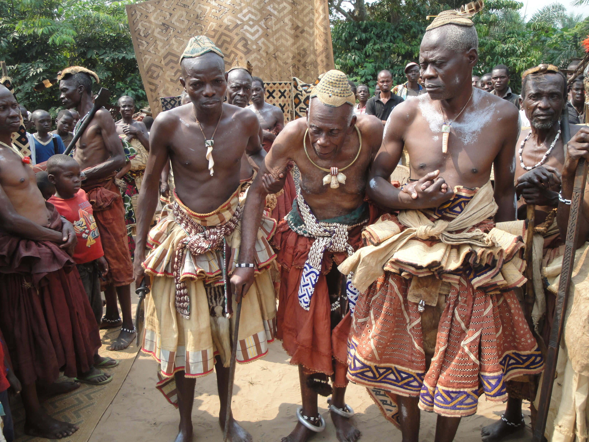

  

1. Building Fiscal Capacity and State Accountability in Fragile Settings

Published and Accepted

- Weigel JL, Bessone P, Bergeron A, Tourek G, Kabeya J ®. 2026. “Supermodular Bureaucrats: Evidence from Randomly Assigned Tax Collectors in the DRC.” Cond. Accepted, *American Economic Review*. [Paper](https://jonathanweigel.com/s/weigel_et-al_collectors.pdf).
- Jensen A and Weigel JL. 2026. “No Taxation Without Administration: Bringing the State Back into the Public Finance of Developing Countries.” *Journal of Economic Literature*. [Working Paper](https://jonathan-weigel.squarespace.com/s/jensen-weigel_no-taxation-without-administration_JEL_2025-sw8w.pdf). [AEA highlight](https://www.aeaweb.org/research/chart/taxation-administration-developing-countries).
- Balan P, Bergeron A, Tourek G, Weigel JL. 2026. “Property Rights and Social Institutions in Urban Africa: Experimental Evidence from a Land Formalization Program in the DRC.” Cond. Accepted, *Comparative Political Studies*. Paper.
- Bergeron A, Tourek G, and Weigel JL. 2024. “The State Capacity Ceiling on Tax Rates: Evidence from Randomized Tax Abatements in the D.R. Congo.” *Econometrica* 92(4): 1163-1193. [Paper](https://jonathan-weigel.squarespace.com/s/bergeron-et-al_state-capacity-ceiling_ecma_2023.pdf). [JPAL Summary](https://www.povertyactionlab.org/evaluation/impact-reducing-tax-rates-and-strengthening-enforcement-revenue-collection-drc).
- Ngindu EK, Weigel JL. 2023. “The Taxman Cometh: A Virtuous Cycle of Compliance and State Legitimacy in the D.R. Congo.” *Economica* (100th Anniversary Edition) 12489: 1-35. Working Paper.
- Balan P, Bergeron A, Tourek G, Weigel JL. 2022. “Local Elites as State Capacity: How Local Information Increases Tax Compliance in the D.R. Congo.” *American Economic Review* 112(3): 1-36. [Paper](https://jonathan-weigel.squarespace.com/s/balan-et-al_chieftaxation_aer_2022.pdf). [VoxDev](https://voxdev.org/topic/public-economics/can-low-capacity-governments-work-local-leaders-increase-tax-revenues-evidence-democratic-republic-congo).
- Weigel JL. 2020. “The Participation Dividend of Taxation: How Citizens in Congo Engage More with the State when It Tries to Tax Them.” *Quarterly Journal of Economics* 135(4): 1849-1903. [Paper](https://jonathan-weigel.squarespace.com/s/participation_dividend_qje_final.pdf). [Appendix](https://jonathan-weigel.squarespace.com/s/weigel_participation_dividend_appendix-j54s.pdf). Related links: [Vox Dev](https://voxdev.org/topic/public-economics/can-taxation-stimulate-political-participation-evidence-democratic-republic-congo), [ICTD](https://www.ictd.ac/blog/participation-property-taxation-drc/), [Law360](https://www.law360.com/tax-authority/articles/1309089/taxation-representation-and-civic-participation-in-congo), [World Bank](http://blogs.worldbank.org/impactevaluations/no-participation-without-taxation-evidence-randomized-tax-collection-dr-congo-guest-post-jonathan).

Working Papers / In Progress

- Bergeron A, Weigel JL, Tourek G, Ngindu EK ®. “Does Collecting Taxes Erode the Responsiveness of Informal Leaders? Evidence from the DRC” R&R, *American Economic Journal - Economic Policy*. Winner of IIPF Peggy and Richard Musgrave Prize 2023. [Working Paper](https://jonathanweigel.com/s/bergeron-et-al_chieftargeting.pdf).
- Tourek G, Laroche A, Bergeron A, Naritomi J, Weigel JL, Ngoma M ®. “Does Progressivity Raise Tax Capacity? Experimental Evidence from DR Congo.” [Working Paper](https://jonathanweigel.com/s/Progressivity_20260710.pdf).
- Ahrenshop M, Bergeron A, Paler L, Tourek G, Weigel JL. “Delegating Tax Collection to Local Elites Does Not Undermine Demand for Accountability in the D.R. Congo.” [Working Paper](https://static1.squarespace.com/static/59832fbcf9a61eb15deffb3c/t/64adcff6ae42c24a0f6735d3/1689112655169/Chief_Good_II.pdf).
- de la O A et al. “Making Citizens Legible to the State: A Six-country Randomized Experiment to Increase Formalization by Reducing Transaction Costs.” [PDF](https://jonathanweigel.com/s/Metaketa_II_paper2026_Submission_Nature2026.pdf).
- Bergeron A, Davoine E, Granato G, Ngoma M, Robinson JA, Weigel JL. “Legal Antecedents of Fiscal Capacity: Experimental Evidence from Congo.” [fieldwork ongoing]
- Bergeron A, Boyer C, Kapon S, Weigel JL. “Does Tax Bargaining Cause State Building? Evidence from the DRC” [fieldwork ongoing]
- Danner S, Ngoma M, Pomeranz D, Tourek G, Weigel JL. “Can Mobile Money Aid Tax Administration? Evidence from the DRC” [fieldwork ongoing]
- Danner S, Ngoma M, Pomeranz D, Tourek G, Weigel JL. “Home Effects in Tax Collection: Evidence from the DRC” [fieldwork ongoing]
- Benshaul-Tolonen A, Cheung C, Miguel E, Mudenda D, Weigel JL. “Extractives and African Development: Evidence from the Largest Copper Discovery in a Century.” [fieldwork ongoing]

2. Interaction Between Culture and Institutions

Published and Accepted

- Bergeron A, Carvalho JP, Henrich J, Nunn N, Weigel JL. 2026. “Zero-Sum Thinking, the Evolution of Effort-Suppressing Beliefs, and Economic Development.” Cond. accepted, *Review of Economic Studies*. [Working Paper](https://jonathan-weigel.squarespace.com/s/w31663.pdf).
- Lang M et al. 2019. “Moralizing Gods, Extended Prosociality, and Religious Parochialism Across 15 Societies.” *Proceedings of the Royal Society B* 286: 20190202. [PDF](https://jonathan-weigel.squarespace.com/s/Lang-et-al_MoralizingGods_ProcRoyalSoc_2019.pdf).
- van Dorp et al. 2019. “The Genetic Legacy of State Centralization in the Kuba Kingdom of the Democratic Republic of Congo.” *Proceedings of the National Academy of Sciences* 116(2): 593-598. [PDF](https://jonathanweigel.com/s/vanDorp-et-al_GeneticLegacyKuba_PNAS_2018full.pdf). [BBC Inside Science](https://www.bbc.co.uk/programmes/m00021r4).
- Lowes S, Nunn N, Robinson JA, and Weigel JL. 2017. “The Evolution of Culture and Institutions: Evidence from the Kuba Kingdom.” *Econometrica* 85(4): 1065-1091. [PDF](https://jonathanweigel.com/s/Lowes-et-al_ECMA_Kuba_Final.pdf). [Appendix](https://jonathanweigel.com/s/kuba_appendix.pdf). Related links: [Cato Institute](https://www.cato.org/publications/research-briefs-economic-policy/evolution-culture-institutions-evidence-kuba-kingdom).

Working Papers

- Ngoma M, Sievert C, Jaravel X, Nunn N, Weigel JL ®. “How Market Access Shapes Wellbeing and Values: Experimental Evidence from the D.R. Congo.” [working paper coming soon]
- Cerkez N, Hartman A, Weigel JL, Zay Ya K. “Can Mental Health Programs Have Social Externalities? Experimental Evidence from Myanmar.” [Working Paper](https://nicolascerkez.com/wp-content/uploads/2026/06/mphss_myanmar.pdf).

3. Political Economy of State Building and Institutional Change

Published and Accepted

- Callen M, Levy G, Muthukumaran S, Weigel JL, Yuchtman N. 2026. “Detecting Critical Junctures in Real Time: Foundations, Measurement, and Applications from 120 Years of Reporting,” Forthcoming in the *Handbook of Political Economy* (eds. Daron Acemoglu, James Robinson). [Working Paper](https://jonathanweigel.com/s/Callen-et-al_Handbook.pdf).
- Callen M, Weigel JL, Yuchtman N. 2024. “Experiments about Institutions.” *Annual Review of Economics* 16:105-31. [Paper](https://www.annualreviews.org/content/journals/10.1146/annurev-economics-091823-031317).

Working Papers / In Progress

- Callen M, Fiorin S, Pande R, Prillaman S, Weigel JL, Yuchtman N. 2026. “Institutional Uncertainty and State Building: National-Scale Evidence from Nepal.” [working paper coming soon]
- Callen M, Pande R, Weigel JL, Yuchtman N. “Procedural Justice and State Capacity: Evidence from Birth Registration in Nepal.” [fieldwork ongoing]
- Callen M, Kanz M, Quiviger Z, Weigel JL, Yuchtman N. “Coordinating Beliefs and Critical Junctures: Experimental Evidence from 18 Countries.” [fieldwork ongoing]

Other Publications

- Bergeron A, Carvalho JP, Henrich J, Nunn N, Weigel JL. “The Dynamics of Development in a Zero-Sum World.” Cond. accepted, *Econometric Society Monographs*, Vol. 3 (Ch. 5). [Working Paper](https://jonathanweigel.com/s/Zero_sum_dynamics_draft2.pdf).
- Naritomi J, Sequeira S, Weigel JL, Weinhold D. 2019. “RCTs as an opportunity to promote interdisciplinary, inclusive, and diverse quantitative development research.” *World Development* 127:104832. [Paper](https://www.sciencedirect.com/science/article/abs/pii/S0305750X19304814).
- Lowes S, Nunn N, Robinson JA, and Weigel JL. 2015. “Understanding Ethnic Identity in Africa: Evidence from the Implicit Association Test (IAT).” *American Economic Review: P&P* 105(5):1-8. [PDF](https://jonathanweigel.com/s/lowes_nunn_robinson_weigel_aerpp_2015.pdf). [Appendix](https://jonathanweigel.com/s/iat_appendix.pdf). [VoxEU](http://www.voxeu.org/article/measuring-identity-tropics).
- Kapepula GT, Konshi MM, Weigel JL. 2022. “Prosociality and Pentecostalism in the D.R. Congo.” *Religion, Brain, and Behavior* 12: 150-170. [Paper](https://jonathan-weigel.squarespace.com/s/rbb_submission_final.pdf).
- Farmer P et al. 2013. “Reduced Premature Mortality in Rwanda: Lessons from Success.” *British Medical Journal* 346:f65. [Paper](https://jonathan-weigel.squarespace.com/s/Farmer-et-al-BMJ-2013.pdf).

  

**Copyright © 2026 ODEKA A.S.B.L All rights reserved.**

 

  <a href="https://twitter.com" class="about-link" rel="" target="">
    <i class="bi bi-twitter"></i>
     twitter
  </a>
  <a href="https://www.instagram.com/gateau_thecongolesecat/" class="about-link" rel="" target="">
    <i class="bi bi-instagram"></i>
     Instagram
  </a>
  <a href="https://linkedin.com" class="about-link" rel="" target="">
    <i class="bi bi-linkedin"></i>
     LinkedIn
  </a>

