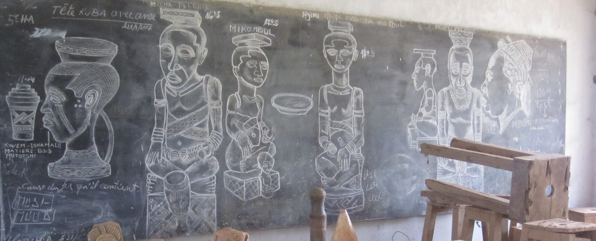

  

Major projects

:::{#major_projects}
:::

Other projects

:::{#other_projects}
:::

  

**Copyright © 2026 ODEKA A.S.B.L All rights reserved.**

 

  <a href="https://twitter.com" class="about-link" rel="" target="">
    <i class="bi bi-twitter"></i>
     twitter
  </a>
  <a href="https://www.instagram.com/gateau_thecongolesecat/" class="about-link" rel="" target="">
    <i class="bi bi-instagram"></i>
     Instagram
  </a>
  <a href="https://linkedin.com" class="about-link" rel="" target="">
    <i class="bi bi-linkedin"></i>
     LinkedIn
  </a>

