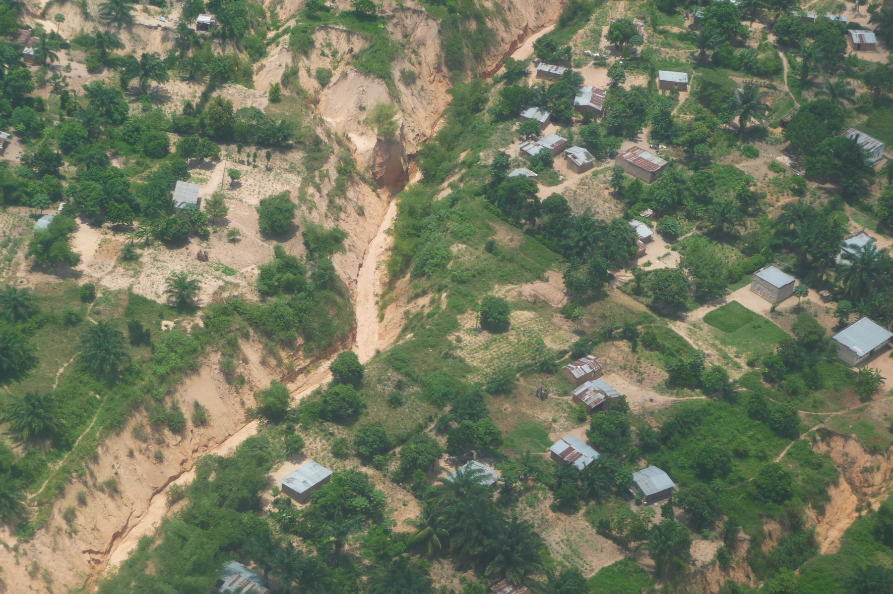

  

### Headquarters address:
6, avenue du Commerce 
L/AZDA (Cinquantenaire) 
Q/TSHINSAMBI C/KANANGA 
KASAÏ CENTRAL, RDC

### General inquiries:
[odeka.contact@gmail.com](mailto:odeka.contact@gmail.com) 
(+243) 9 79 49 50 67 
(+243) 8 30 62 28 20

### Legal inquiries:
(+243) 9 94 63 66 87

### Website administrator:
[odeka.webmaster@gmail.com](mailto:odeka.webmaster@gmail.com) 

  

### Legal Notice:

**ODEKA A.S.B.L** is a 004/2001 nonprofit organization registered in the Democratic Republic of the Congo. It is incorporated in the Province of Central Kasaï under registration number 169/2020/KGA.

Tax identification number: A2045536T

**ODEKA A.S.B.L**'s mission is to support evidence-based development initiatives in the Democratic Republic of Congo.

This website is published and maintained by **ODEKA A.S.B.L**. Unless otherwise stated, all content on this site is the property of **ODEKA A.S.B.L** and may not be reproduced without prior written permission.

**Copyright © 2026 ODEKA A.S.B.L All rights reserved.**

