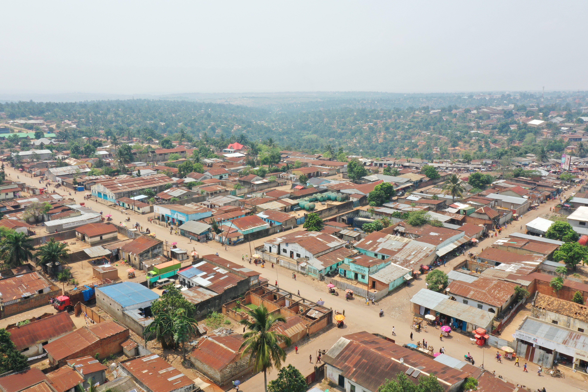

---
about:
  template: jolla
  links:
    - icon: twitter
      text: twitter
      href: https://twitter.com
    - icon: instagram
      text: Instagram
      href: https://www.instagram.com/gateau_thecongolesecat/
    - icon: linkedin
      text: LinkedIn
      href: https://linkedin.com

page-layout: full
listing:
  - id: projects_carousel
    type: grid
    contents: 03_projects/posts
    include:
      type: major
      status: ongoing
    max-items: 4
    grid-columns: 4
    sort: "date desc"
    fields: [title, image, description]
  # NEWS SWITCH: comment out this whole news_carousel block (id through
  # fields) when News is off. Leaving it defined but unplaced (because
  # news_section_off.qmd has no :::{#news_carousel} marker) makes Quarto
  # dump it, unstyled, at the very bottom of the page instead of hiding it.
  - id: news_carousel
    type: grid
    contents:
      - "04_news/posts/*.qmd"
    max-items: 4
    grid-columns: 4
    sort: "date desc"
    fields: [title, date, image]

---

  
  

"You cross to my side, and I cross to yours, so that we may meet. Who am I?"

Kuba proverb

Good intentions are not enough. We use history, culture, institutions, economic theory, and insights across disciplines to understand what might work, and rigorous experiments to learn what does, what does not, for whom, and in which context.

Here is what that looks like in practice.

<h2>Ongoing major projects</h2>

:::{#projects_carousel}
:::

<a class="about-button home-manifesto-cta" href="03_projects/index.html">Explore all our projects →</a>

<blockquote>Intentionally or not, the forms of economic, industrial, and political organization that were central to each success story were drawn from the local context, or by melding lessons from economics and political science with characteristics of local culture and society.</blockquote>
<cite>Jacob Moscona, Nathan Nunn &amp; James A. Robinson"Searching for Fish in Trees (缘木求鱼)? Economic Development When Context Matters," Working Paper, 2026</cite>

  
  <a class="about-button banner-cta banner-cta--green" href="05_jobs/index.html">Looking for a job? →</a>

<!-- =====================================================================
     NEWS SECTION SWITCH — see read_me/ for the full instructions.
     Currently pointing at news_section_on.qmd. To turn News OFF,
     change the filename below to news_section_off.qmd — that's the
     only edit needed here. Also flip the switch in _quarto.yml (see
     its own comment) for the rest of the steps.
     ===================================================================== -->


  

**Copyright © 2026 ODEKA A.S.B.L All rights reserved.**

 

