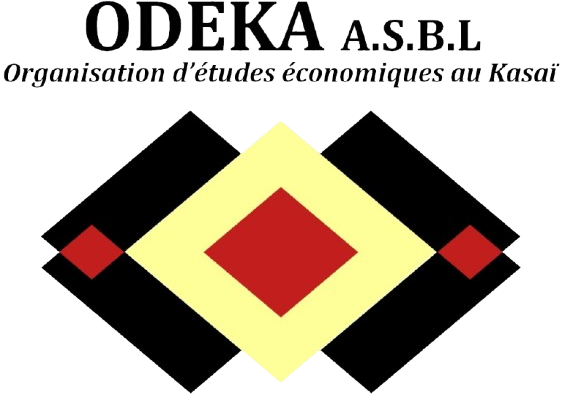

---
about:
  template: jolla
  links:
    - icon: twitter
      text: twitter
      href: https://twitter.com
    - icon: instagram
      text: Instagram
      href: https://www.instagram.com/gateau_thecongolesecat/
    - icon: linkedin
      text: LinkedIn
      href: https://linkedin.com

page-layout: full
listing:
  - id: projects_carousel
    type: grid
    contents:
      - "03_projects/posts/*.qmd"
    max-items: 4
    grid-columns: 4
    sort: "date desc"
    fields: [title, image]
  - id: news_carousel
    type: grid
    contents:
      - "04_news/posts/*.qmd"
    max-items: 4
    grid-columns: 4
    sort: "date desc"
    fields: [title, date, image]

---

  
  

"You cross to my side, and I cross to yours, so that we may meet. Who am I?"

Kuba proverb

Good intentions are not enough. We use history, culture, institutions, and insights across disciplines to understand what might work, and rigorous experiments to learn what does, what does not, for whom, and in which context.

<blockquote>Intentionally or not, the forms of economic, industrial, and political organization that were central to each success story were drawn from the local context, or by melding lessons from economics and political science with characteristics of local culture and society.</blockquote>
<cite>Jacob Moscona, Nathan Nunn &amp; James A. Robinson"Searching for Fish in Trees (缘木求鱼)? Economic Development When Context Matters," Working Paper, 2026</cite>

  <h2 style="margin: 5; font-size: 1.6rem; font-weight: 700; color: #333;">
    Latest Projects
  </h2>
  <a href="03_projects/index.html" style="font-size: 1rem; color: #0077b5; text-decoration: none; font-weight: 600;">
    View all projects →
  </a>

:::{#projects_carousel}
:::

<blockquote>Because they require time in the field, experiments provide economists a richer sense of context than many would otherwise obtain.</blockquote>
<cite>Michael Kremer"Experimentation, Innovation, and Economics," American Economic Review 110(7), 2020, pp. 1974–1994</cite>

  <h2 style="margin: 5; font-size: 1.6rem; font-weight: 700; color: #333;">
    Latest News
  </h2>
  <a href="04_news/index.html" style="font-size: 1rem; color: #0077b5; text-decoration: none; font-weight: 600;">
    View all news →
  </a>

:::{#news_carousel}
:::

  

**Copyright © 2026 ODEKA A.S.B.L All rights reserved.**

 

